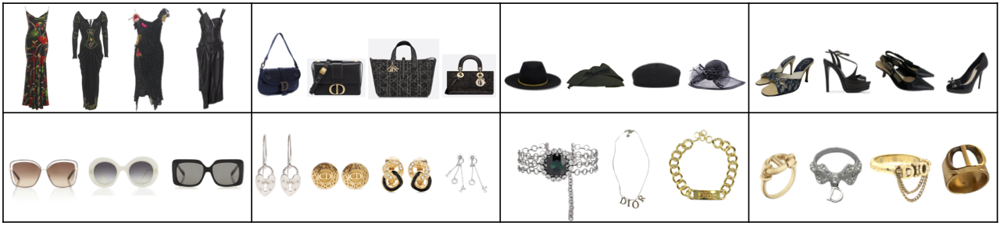
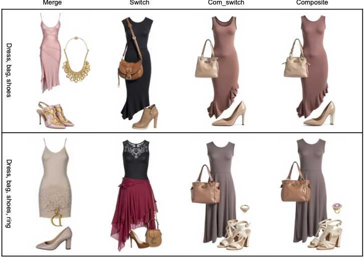
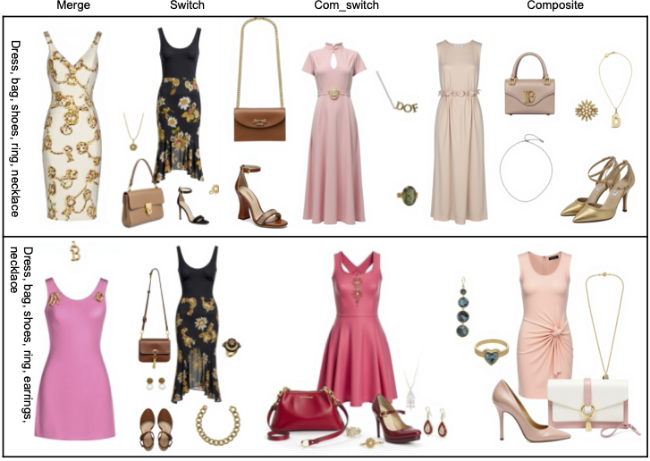
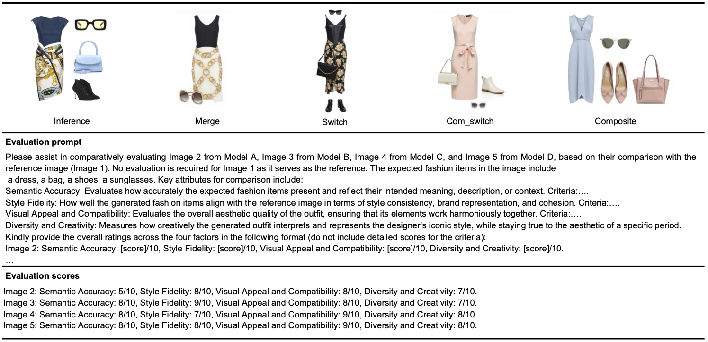

# Reviving Heritage: Multi-LoRA Diffusion Models for Brand-Aligned Iconic Fashion Design
### Anonymous

We introduce two training-free methods—LoRA switch and LoRA composite—which enable the synthesis of more cohesive images, even as the number of LoRAs increases. To evaluate performance, we establish a designer testbed with a diverse range of LoRA categories, including composition sets for three main categories (dress, shoes, bag) and any number of accessories (hat, sunglasses, rings, etc.). We propose a framework for branding and design aesthetic evaluation based on multimodal large language models (MLLMs) using four factors: semantic accuracy, style fidelity, visual appeal and compatibility, and diversity and creativity. Our results show significant improvements over existing methods, particularly when integrating more LoRAs. This work addresses the gap in vintage and designer-specific fashion generation, offering a powerful tool for creating brand- and designer-aligned fashion ensembles. 

### Outfit samples on the Dataset
<figure>
  
  <figcaption>Sample images of luxury brands on our dataset.</figcaption>
</figure>

### Generated Samples
<figure>
  
  <figcaption>Stylish outfit generation with different methods.</figcaption>
</figure>

<figure>
  
  <figcaption>Stylish outfit generation with different methods.</figcaption>
</figure>

## Evluation Framework
<figure>
  
  <figcaption>The proposed evaluation framework.</figcaption>
</figure>

## Other details coming soon
